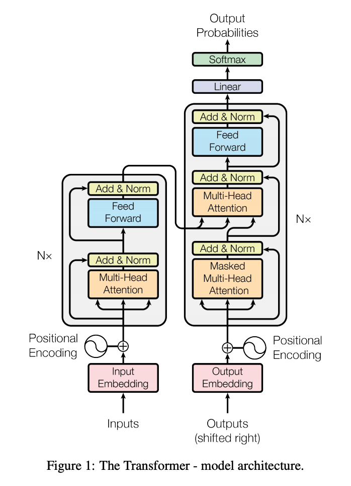
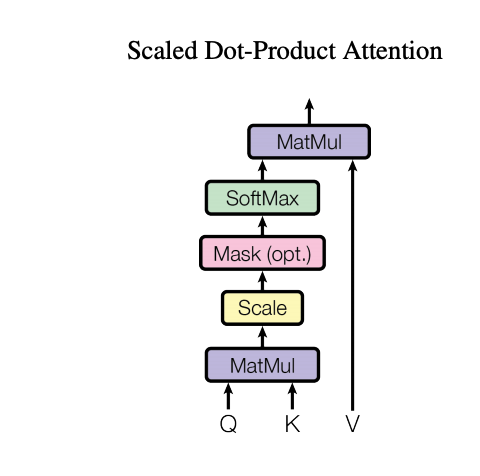
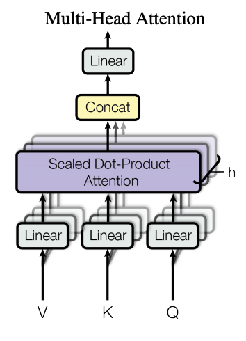
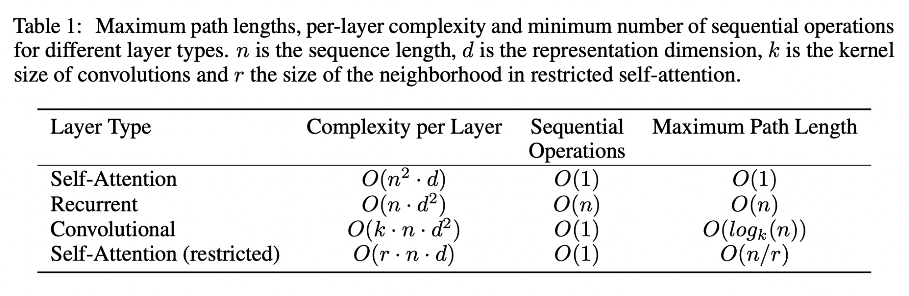

# Project Description:

Transformer based architectures are increasingly common in my projects. 
In this repo I implement a transformer architecture. It's not reinventing the wheel. It's more like re-writing and taking notes.   
**STATUS:**  
Code - in progress  
ReadME - in progress

## Resources used ##
You'll find resources I used below:
- [Understanding LSTMs](https://colah.github.io/posts/2015-08-Understanding-LSTMs/)  
    - provides background on LSTMs 
- [The Illustrated Transformer](https://jalammar.github.io/illustrated-transformer/)
- [The Annotated Transformer](https://nlp.seas.harvard.edu/2018/04/03/attention.html)  
    - Some researchers at Harvard already did the job for me. I use this resource as a recipe. 
    - If you want a rigorous and detailed explanation of each component in a transformer, just look at this resource.
- Understanding Multi Head Attention:
    - The following videos are great for understanding attention.  
        - [Rasa Algorithm Whiteboard - Transformers & Attention 1: Self Attention](https://www.youtube.com/watch?v=yGTUuEx3GkA)  
        - [Rasa Algorithm Whiteboard - Transformers & Attention 2: Keys, Values, Queries](https://www.youtube.com/watch?v=tIvKXrEDMhk)  
        - [Rasa Algorithm Whiteboard - Transformers & Attention 3: Multi Head Attention](https://www.youtube.com/watch?v=23XUv0T9L5c)  
- Understanding applications of Transformers to NLP
    - [The Illustrated Bert, Elmo, and co.](https://jalammar.github.io/illustrated-bert/)  

## [Attention is All You Need](https://arxiv.org/abs/1706.03762)
Below you will find some of my notes from the paper. 

### The Transformer Architecture

In RNN's we have a sequence of hidden states *ht*, which is a function of the previous hidden state *ht-1* and the input for position *t*. The sequential nature of this computation prevents parallelization within training examples. And that's something we actually need when working with long sequences.

Self-attention is an attention mechanism that relates different positions of a single sequence in order to compute a representation of the sequence. The Transformer architecture proposed in this paper is the first  to rely entirely on self-attention.

Consider an encoder-decoder structure. 

The encoder maps an input sequence of symbol representations, *x = (x1, x2, ..., xn)*, to a sequence of continuous representations, *z = (z1, ..., zn)*. Given *z*, the decoder generates an output sequence *y = (y1, y2, ..., yn)* of symbols one element at a time. At each timestep, the model is auto-regressive: it consumes previously generated symbols as inputs for predicting the next symbol. So for instance, we predict *yt* given *(yt-1, yt-2, ..., y1, zn, ..., z1)*.

On the left we have the encoder, on the right we have the decoder.

### Encoder

The encoder has a stack of N = 6 identical layers:

-   each with 2 sub-layers:
    -   Multi-head self attention mechanism
    -   Simple, position-wise fully connected feed-forward network
-   Each sub-layer contains a residual connection (Add) followed by layer normalization
    -   *LayerNorm(x + Sublayer(x))*, where *Sublayer(x)* is the function implemented by the sublayer itself

### Decoder

The decoder has a stack of *N* = 6 layers:
-   each with 3 sub-layers:
    -   Multi-head attention over the output of the encoder stack. We have a mask applied so as to prevent positions from attending to subsequent positions. This masking, combined with the fact that the output embeddings are offset by 1 position, ensures that predictions for position *t* can only depend on the known outputs at positions < *t*.
    -   Multi-head self attention mechanism
    -   Simple, position-wise full connected feed-forward network
-   Each sub-layer contains a residual connection (Add) followed by layer normalization
    -   *LayerNorm(x + Sublayer(x))*, where *Sublayer(x)* is the function implemented by the sublayer itself

### Attention, Scaled Dot Product Attention, and Multi-Head Attention

Attention can be described as a function to map a query and a set of key-value pairs to an output. Query, keys, values, and outputs are vectors here. The output is a weighted sum of the values, where the weight assigned to each value is computed by some compatibility function of the query with the corresponding key.

In this case, we concentrate on **Scaled Dot-Product Attention**.

Input:
-   queries *Q*, keys *K*, of dimension *dk*
-   values *V*, of dimension *dv*

*Attention(Q, K, V) = softmax(QKT/sqrt(dk))V*

Two commonly used attention functions are:
-   Dot product attention (this but without the scaling factor)
-   Additive attention (compute compatibility using feed-forward neural network with single hidden layer)

Dot product attention is faster, and more space efficient because it can be implemented using optimized matrix multiplication code. The scaling factor here is used because additive attention performs better for large values of *dk*. The suspected reason for this is that as *dk* increases, the dot products grow large in magnitude, pushing the softmax into regions with extremely small gradients.

Now we look at **Multi-Head Attention**

Instead of performing one attention function with dmodel dimensional keys, values, and queries, the authors linearly project the queries, keys, and values *h* times with different learned linear projections to *dk*, *dk*, *dv* dimensions respectively. Then, the attention function is performed in parallel, which yields *dv* dimensional output values. These are concatenated and projected once again.

The reason we use multi-head attention is that it allows the model to jointly attend to information from different representation subspaces at different positions. A single head would inhibit this.

*MultiHead(Q, K, V) = Concat(head1, head2, ..., headh)WO*, 
where *headi = Attention(QWiQ, KWiK, VWiV)*

The projections are learned parameter matrices.

Attention is used in a number of ways:
-   In the encoder-decoder attention layers
    -   Queries come from pervious decoder layer
    -   Keys and values come from output of the encoder
    -   => every position in the encoder attends over all positions in the input sequence
-   The encoder contains self-attention layers
    -   Keys, values, queries come from the same place: output of previous layer in the encoder
    -   Each position in encoder attends to all positions in previous layer of the encoder
-   Self-attention layers in the decoder
    -   Same as with encoder except that a mask is used to prevent leftward information flow

### Why did they use self-attention?

Self-attention was used with 3 considerations in mind:

1.  Decreasing the computational complexity per layer:  
    

2.  The amount of computation that can be parallelized (measured by minimum number of sequential operations required)

3.  Path-length between long range dependencies in the network. 
    - Learning long-range dependences is key to sequence transduction tasks. The path length in question can be described as the length of the paths forward and backward signals have to traverse in the network to capture long-range dependencies. The shorter the paths between any combination of positions in the input and output sequences the easier it is to learn long-range dependencies.

### Position-wise Feed-Forward Networks

Each layer in the encoder and decoder contains such a network, which is applied to each position separately and identically. Its 2 linears transformation with ReLu activation:  
-   *FFN(x) = max(0, xW1 + b1)W2 + b2*

### Embeddings

Word embeddings are learned, and there's not much new to say here if you're familiar with Language Modelling, word embeddings, etc.

### Positional Encodings

Positional encodings are introduced. The goal is to use a mapping that maintains the relative positions of elements in a sequence. The sine and cosine functions of different frequencies below achieve this. Learned positional encodings work too, but these functions worked.  
-   *PE(pos, 2i) = sin(pos/100002i/dmodel)*
-   *PE(pos, 2i+1) = cos(pos/100002i/dmodel)*

### Conclusion

They trained this on a lot of data, with a lot of resources, and it worked well. By replacing the recurrent layers of previous encoder-decoder architectures with multi-head attention, we have a Transformer architecture which can be trained more efficiently and that is better at capturing long range dependencies.
